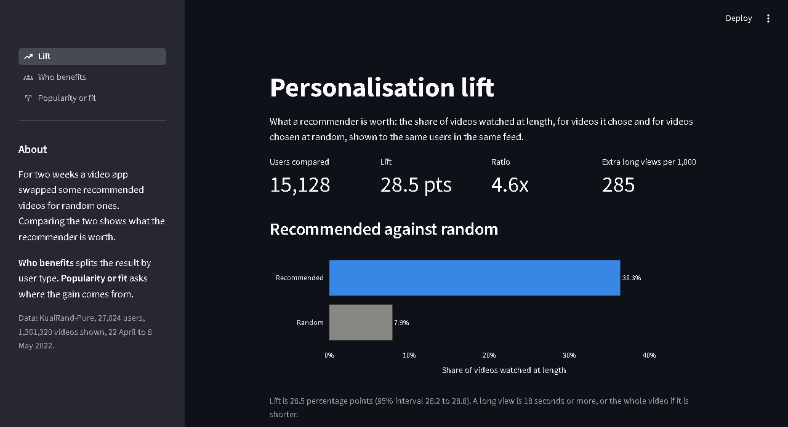
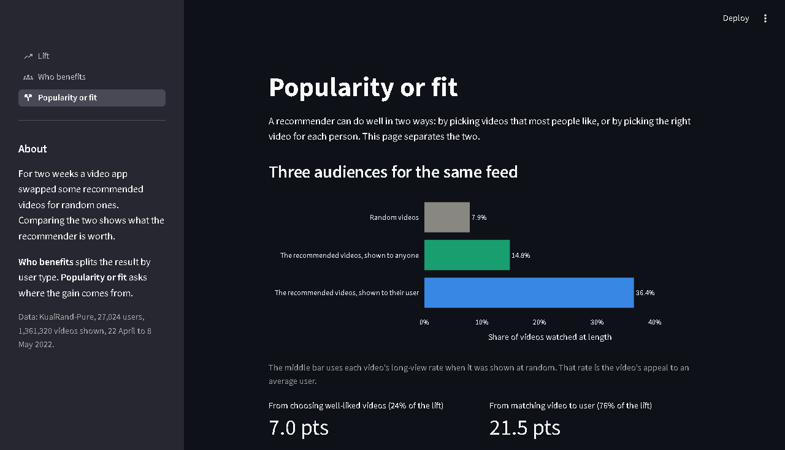

# Personalisation Lift

Measures what a video recommender is worth, using an experiment in which a real app replaced some recommended videos with random ones.

**Try it:** https://personalisation-lift-dkvysrjbxfpijjzcnot9ju.streamlit.app/

**Built with:** Python, pandas, NumPy, Plotly, Streamlit



## Key findings

- **Recommended videos were watched at length 4.6 times as often as random ones.** 36.3% against 7.9%, which is 285 extra long views for every 1,000 videos shown.
- **Most of the gain is matching, not popularity.** About a quarter comes from showing videos that most people like. The other three quarters comes from showing each user the videos that suit them.
- **Every type of user gains by a similar factor.** The ratio is between 4.1x and 4.7x for daily, frequent, occasional and new users.
- **Known limit:** videos were randomised, not users, so this measures watching and not retention (see [Limitations](#limitations)).

## Why I built it

A streaming service cannot tell from its normal logs whether its recommender is good. People watch what they are shown, so a recommended video always looks popular. The only fair test is to show some videos the recommender did not choose, and compare.

Kuaishou, a short-video app, did this for 17 days in 2022 and published the logs as [KuaiRand](https://kuairand.com/). I used them to answer three questions:

1. How much more do people watch recommended videos than random ones?
2. Is that true for every type of user?
3. Is the recommender matching videos to people, or only showing popular videos?

## What it does

| Step | What happens |
|---|---|
| 1. Data | The logs become one row per video shown, marked as recommended or random: 27,024 users, 1,361,320 videos shown |
| 2. Lift | Each user's long-view rate on recommended videos is compared with their own rate on random ones |
| 3. Segments | The comparison is repeated for eight types of user |
| 4. Popularity or fit | The lift is split into two parts: choosing well-liked videos, and matching them to the user |
| 5. App | A Streamlit app shows the lift, the segments and the split |

Two terms are used throughout:

- **Long view:** the user watched 18 seconds or more, or the whole video if it is shorter.
- **Lift:** a user's long-view rate on recommended videos minus their rate on random videos.

## How the lift is measured

Every user saw both kinds of video in the same feed and the same weeks, so each user is their own control.

1. For each user, work out the long-view rate on recommended videos and on random videos.
2. Subtract one from the other. That is the user's lift.
3. Average over users. Resample the users 2,000 times to get a 95% interval.

A user needs at least 5 videos of each kind to be compared. That leaves 15,128 of the 27,024 users.

## Results

| | Recommended | Random | Ratio |
|---|---|---|---|
| Watched at length | 36.3% | 7.9% | 4.6x |
| Likes per 1,000 videos | 20.2 | 4.7 | 4.3x |
| Dislikes per 1,000 videos | 0.7 | 1.5 | 0.4x |
| Seconds watched per video | 24.6 | 6.2 | 4.0x |

The lift in long views is 28.5 percentage points (95% interval 28.2 to 28.8). 91% of users had a positive lift.

### By type of user

| Group | Users | Recommended | Random | Ratio |
|---|---|---|---|---|
| Daily | 10,153 | 34.2% | 7.3% | 4.7x |
| Frequent | 3,061 | 39.9% | 8.8% | 4.5x |
| Occasional | 1,355 | 42.8% | 9.3% | 4.6x |
| Rare or new | 548 | 40.9% | 9.9% | 4.1x |

I expected rare and new users to gain much less, because the recommender has little history for them. Their ratio is the lowest, but its interval (3.7 to 4.6) overlaps the others, so this data does not confirm it.

### Popularity or fit

A recommender can do well by picking videos most people like, or by picking the right video for each person. To separate the two, I used each video's long-view rate when it was shown at random. That rate is the video's appeal to an average user.

| Audience | Watched at length |
|---|---|
| Random videos | 7.9% |
| The recommended videos, shown to anyone | 14.8% |
| The recommended videos, shown to their user | 36.4% |

The first step (7.9% to 14.8%) is the gain from choosing well-liked videos: 24% of the lift. The second step (14.8% to 36.4%) is the gain from matching: 76% of the lift. A feed of popular videos alone would capture only a quarter of the gain.



## Checks

- **Random videos were spread evenly.** The most-shown 10% of videos took 12% of random showings, against 61% of recommended ones. An even spread would be 10%.
- **The gap holds every day.** On each of the 17 days the recommended rate was between 32% and 38%, and the random rate between 7% and 9%.
- **The user cut-off does not matter.** With a minimum of 1, 3, 5, 10 or 20 videos of each kind, the ratio stays between 4.6x and 4.7x.
- **The sample is large enough.** It could detect a lift as small as 0.4 points.
- **Segments are corrected for multiple tests.** Eight groups are compared, so each interval is widened to keep 95% cover across all of them.

## Limitations

- **This is not a two-group A/B test.** Videos were randomised, not users. It measures what people did with each video, not whether a worse feed makes them leave.
- **Only the pool's videos are compared.** The random videos came from about 7,300 titles, and the recommended side is limited to the same titles. That is a small part of what the app shows.
- **The matching share is a remainder.** It includes anything else that differs between the two kinds of video, such as where in a session each was shown.
- **Rare and new users are under-represented.** Those with five videos of each kind are the more active members of that group.
- **The setting differs from long-form streaming.** These are short videos on a Chinese app in 2022. The method carries over; the numbers may not.

## Run it

```bash
pip install -r requirements.txt
streamlit run app.py
```

The results are in the repo, so the app runs as is. To rebuild them, download `KuaiRand-Pure.tar.gz` from [Zenodo](https://zenodo.org/records/10439422), unpack it into `data/raw/`, and run:

```bash
python src/build_dataset.py
python src/lift.py
```

## Files

```
app.py                 Entry point: sidebar and page navigation
views/                 The three pages: lift, who benefits, popularity or fit
charts.py              Data loading and the chart both result pages use
src/build_dataset.py   Raw logs to one row per video shown
src/lift.py            The lift, the segments, the checks and the popularity split
reports/               Results the app reads
data/processed/        The cleaned dataset and one row per user
docs/                  Screenshots used in this README
```

Data: Gao et al., *KuaiRand: An Unbiased Sequential Recommendation Dataset with Randomly Exposed Videos*, CIKM 2022. The dataset is shared under CC BY-SA 4.0, and the processed files here are shared under the same licence.
